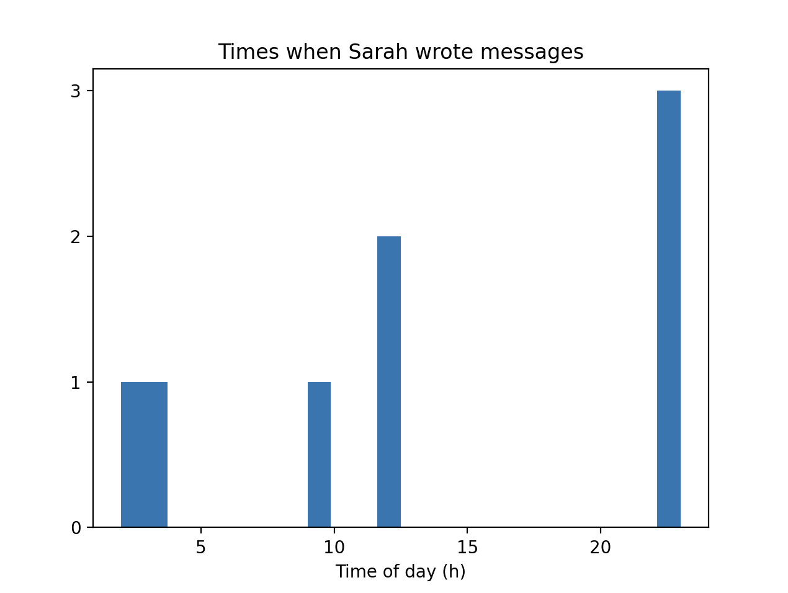
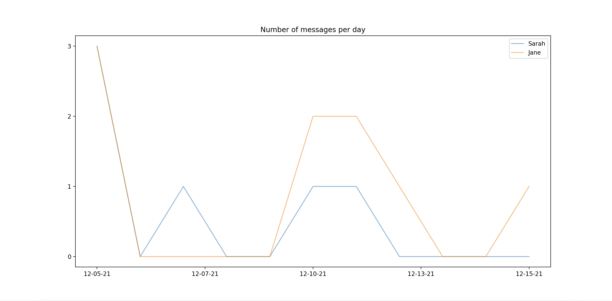

# WhatsApp Chat Analyzer

Welcome to the WhatsApp Chat Analyzer! This tool allows you to extract insightful statistics and analysis from exported WhatsApp chat logs. By providing detailed insights into your chat behaviors, this analyzer can transform a simple .txt chat file into a rich source of information.

## Features

WhatsApp Chat Analyzer offers the following features:

- **Time Analysis**: Determine who texts at what times of the day, giving you insight into the activity patterns of chat participants.
- **Frequency of Texts**: Analyze how often each participant texts, helping you understand who the most active users are.
- **Link Sharing**: Extract all URLs shared in the conversation, providing a list of shared resources and websites.
- **Longest Messages**: Identify the longest messages sent in the chat, which can be interesting to see who sends the most detailed messages.
- **Double Texting**: Check how often a person sends consecutive messages without a reply from others, indicating their engagement and eagerness in the conversation.




## How to Use

To get started with the WhatsApp Chat Analyzer, you need an exported WhatsApp chat file in `.txt` format. You can export your chat from WhatsApp by following the detailed instructions provided here: [Export WhatsApp Chat](https://faq.whatsapp.com/1180414079177245/?locale=en_US&helpref=platform_switcher&cms_platform=iphone&cms_id=1180414079177245&draft=false).

### Steps:

1. Export your WhatsApp chat to a `.txt` file.
2. Clone this repository to your local machine.
3. Place your exported `.txt` file in the designated folder (`chats/`).
4. Run the analyzer script with the path to your file:
5. Review the output statistics and insights generated by the tool.

## Requirements

- Python 3.x
- Necessary Python packages: `pandas`, `matplotlib` (These can be installed via pip if not already installed)

## Installation

Clone this repository using Git:
```
git clone https://github.com/anton325/WhatsAppAnalyzer.git
cd whatsapp-chat-analyzer
```

Install the required Python packages:
```
pip install -r requirements.txt
```

## Contributing

Feel free to fork the repository, make changes, and submit pull requests. We appreciate your contributions to improve the WhatsApp Chat Analyzer!

## License

This project is licensed under the MIT License - see the [LICENSE](LICENSE) file for details.

